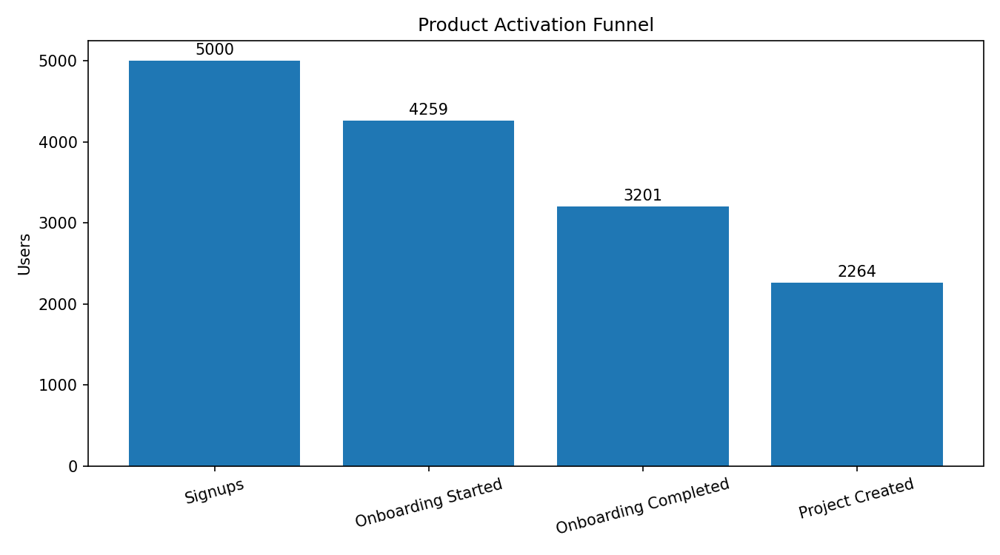
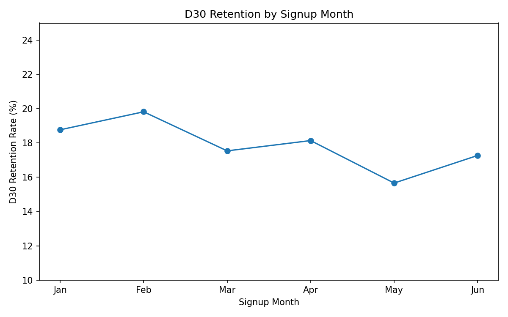
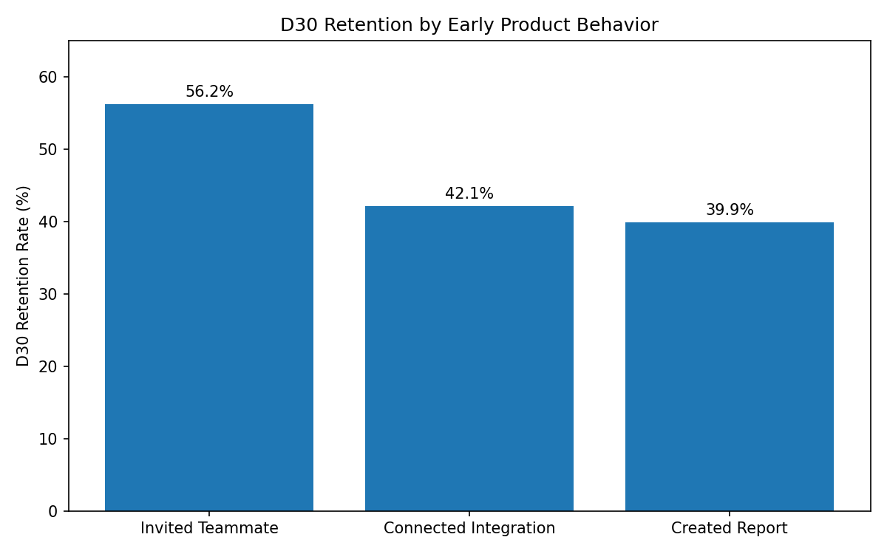

# Product Activation & Retention Analysis

## Business Problem

A fictional B2B SaaS product has seen steady signup growth, but long-term user retention has not improved.

The product team wants to understand:

- Where users drop during onboarding
- Which early product behaviors are associated with stronger retention
- Whether the current activation definition is meaningful
- What product intervention should be tested next

The goal of this analysis is to identify behaviors that distinguish retained users and translate those findings into an experiment recommendation.

---

## Executive Summary

The analysis covered 5,000 synthetic users and 18,431 product events.

Key findings:

- 45.28% of users created their first project within 7 days of signup.
- 17.82% of all users returned and viewed the dashboard between day 30 and day 40.
- The largest funnel loss occurred before onboarding completion.
- Among users who created a project, those who invited a teammate had 56.21% D30 retention compared with 26.24% for those who did not.
- This represents a 29.97 percentage-point difference and approximately 2.1x higher retention.

Teammate invitation therefore appears to be a strong behavioral signal associated with retention.

However, this analysis shows association, not causation. More engaged users may simply be more likely to invite teammates.

The recommended next step is an A/B test that encourages users to invite a teammate immediately after creating their first project.

---

## Metric Definitions

### Activation

A user is considered activated if they create their first project within 7 days of signup.

```text
Activation Rate =
Users creating a project within 7 days
/
Total signups
```

Observed activation rate: **45.28%**

### D30 Retention

A user is considered retained if they generate a `dashboard_viewed` event between day 30 and day 40 after signup.

This is a 30–40 day retention window rather than exact-day D30 retention.

Observed retention rate: **17.82%**

---

## Data

The project uses a synthetic product analytics dataset containing two main tables.

### users

| Column | Description |
|---|---|
| user_id | Unique user identifier |
| signup_date | Date the user signed up |
| country | User country |
| platform | Web, iOS or Android |
| acquisition_channel | User acquisition source |

### events

| Column | Description |
|---|---|
| user_id | User identifier |
| event_timestamp | Timestamp of the product event |
| event_name | Product event |

The event stream contains:

- signup
- onboarding_started
- onboarding_completed
- project_created
- teammate_invited
- integration_connected
- report_created
- dashboard_viewed

---

## 1. Activation Funnel

The first analysis examines how users progress from signup to the first meaningful product action.

| Funnel Stage | Users | Step Conversion |
|---|---:|---:|
| Signup | 5,000 | 100% |
| Onboarding Started | 4,259 | 85.18% |
| Onboarding Completed | 3,201 | 75.16% |
| Project Created | 2,264 | 70.73% |

Overall activation rate: **45.28%**

The largest absolute loss occurs before users complete onboarding.

Out of 5,000 signups, 3,201 users complete onboarding and 2,264 go on to create their first project.

This suggests two areas worth investigating:

1. Friction during onboarding
2. Difficulty reaching first product value after onboarding



---

## 2. Retention Analysis

Overall retention in the day 30–40 window is **17.82%**.

Retention was also analyzed across signup cohorts, platforms and acquisition channels.

Monthly retention ranged from:

- 19.82% in February
- 15.66% in May

The variation between signup cohorts is noticeable but relatively small compared with the behavioral differences identified later in the analysis.



---

## 3. Behavioral Drivers of Retention

The next question was whether particular early product behaviors were associated with stronger long-term retention.

Raw retention rates among users performing several key actions were:

| Behavior | D30 Retention |
|---|---:|
| Invited teammate | 56.21% |
| Connected integration | 42.11% |
| Created report | 39.91% |



At first glance, teammate invitation appears to be the strongest retention signal.

However, comparing users who invited teammates with every user who did not invite a teammate creates an unfair comparison. A user must first create a project before they can invite a teammate.

The non-inviter group therefore contains many users who never activated.

To create a more meaningful comparison, the analysis was restricted to users who had already created a project.

### Retention Among Project Creators

| Behavior | Users | Retained Users | D30 Retention |
|---|---:|---:|---:|
| Invited teammate | 991 | 557 | 56.21% |
| Did not invite teammate | 1,273 | 334 | 26.24% |

The absolute difference is **+29.97 percentage points**.

In relative terms, users who invited a teammate had approximately **2.1x higher retention**.

This makes teammate invitation a strong candidate for an activation behavior worth testing.

---

## 4. Segmentation

Retention was also analyzed across acquisition channels and platforms.

### Acquisition Channel

| Channel | D30 Retention |
|---|---:|
| LinkedIn | 18.92% |
| Direct | 18.58% |
| Referral | 17.87% |
| Paid Search | 17.43% |
| Organic | 17.04% |

### Platform

| Platform | D30 Retention |
|---|---:|
| Android | 19.52% |
| iOS | 17.31% |
| Web | 17.26% |

The differences across acquisition channels and platforms are relatively modest.

For example, the highest and lowest acquisition-channel retention rates differ by less than 2 percentage points.

This suggests that early product behavior may be more useful for generating retention hypotheses than acquisition source alone in this dataset.

---

## Key Finding

The strongest behavioral signal identified in the analysis is teammate invitation.

Among users who had already created a project:

**56.21% D30 retention for users who invited a teammate**

compared with:

**26.24% D30 retention for users who did not invite a teammate**

This is a substantial difference, but it should not be interpreted as causal evidence.

Several explanations are possible:

- Collaborative usage may create more product value.
- Users with stronger intent may naturally be more likely to invite teammates.
- Teams may have more reasons to return to the product.
- Teammate invitation may simply be a signal of deeper engagement.

The analysis therefore generates a product hypothesis rather than proving that teammate invitations cause higher retention.

---

## Product Recommendation

Test whether encouraging collaboration immediately after users experience their first meaningful product value can improve retention.

The proposed product intervention is:

> After a user creates their first project, show a contextual prompt encouraging them to invite a teammate.

The prompt should appear after first project creation rather than at the beginning of onboarding so that users experience some product value before being asked to collaborate.

---

## Proposed Experiment

### Hypothesis

Encouraging users to invite a teammate after creating their first project will increase D30 retention.

### Eligibility

Users who successfully create their first project.

### Control

Current product experience after project creation.

### Treatment

A contextual teammate invitation prompt shown immediately after the user's first project is created.

### Primary Metric

D30 retention measured using the same day 30–40 retention window used in the analysis.

### Secondary Metric

Teammate invitation rate within 7 days.

This acts as a leading indicator showing whether the treatment actually changes the target behavior.

### Guardrail Metrics

- Report creation rate
- Integration connection rate
- Cancellation or uninstall rate

### Experiment Parameters

Baseline D30 retention among project creators who did not invite a teammate: **26.24%**

Minimum detectable effect: **+5 percentage points**

Expected treatment retention: **31.24%**

Statistical assumptions:

- Significance level (alpha): 0.05
- Statistical power: 80%
- Two-sided test

Required sample size: **1,285 users per variant**

Total experiment sample: **2,570 users**

The experiment should run until the required sample is reached and users have had enough time to complete the retention observation window.

---

## Limitations

This project uses synthetic data and should not be interpreted as evidence from a real product.

Important limitations include:

- Retention probability was intentionally designed to be higher for users who invite teammates.
- Retention events were generated only for users who created a project.
- Project creation is therefore mechanically related to retention in the synthetic dataset.
- Behavioral relationships demonstrate the analytical workflow rather than real-world causal effects.
- The teammate invitation analysis is observational and cannot establish causality.
- The dataset does not include experiment exposure data or real customer outcomes.

In a production environment, the analysis would also require validation of event instrumentation, experiment eligibility, tracking quality and sufficient observation windows.

---

## Repository Structure

```text
product-activation-retention-analysis/
├── README.md
├── data/
│   ├── users.csv
│   └── events.csv
├── sql/
│   ├── 01_kpis.sql
│   ├── 02_funnel.sql
│   ├── 03_retention.sql
│   └── 04_activation_analysis.sql
├── python/
│   ├── generate_data.py
│   ├── experiment_analysis.py
│   └── visualizations.py
├── outputs/
│   └── charts/
│       ├── activation_funnel.png
│       ├── retention_by_behavior.png
│       └── retention_by_cohort.png
└── requirements.txt
```

---

## Analysis Workflow

The project follows a product analytics workflow:

**Business problem → Metric definition → Activation funnel → Retention analysis → Behavioral analysis → Product hypothesis → Experiment design**

The objective is not only to calculate metrics, but to connect analysis with a product decision.

---

## Tools Used

- SQL / MySQL
- Python
- Pandas
- NumPy
- Matplotlib
- SciPy
- Git / GitHub